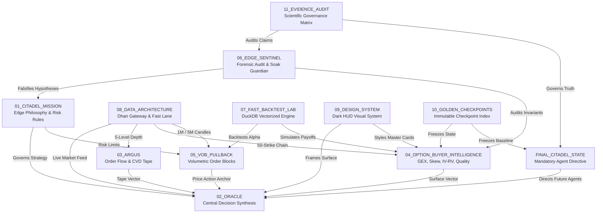

# 🕸️ CITADEL OBSIDIAN KNOWLEDGE GRAPH MAP

## Overview
This visual topology maps all connections, data lineages, and conceptual relationships across the **CITADEL MASTER KNOWLEDGE SYSTEM**. In Obsidian's Graph View, these links form a resilient, self-referential graph network.

---

## 1. System Execution & Data Flow Graph

---

## 2. Document Cross-Reference Map

- **Root Access Points**:
  - [[FINAL_CITADEL_STATE]] ➔ The mandatory starting point for all AI agents.
  - [[00_MASTER_INDEX]] ➔ The central table of contents and ecosystem sitemap.
  - [[CURRENT_CITADEL_STATE]] ➔ Real-time operational status and component health.
- **Core Trading Engine Stack**:
  - [[MISSION_AND_EDGE|01 — Citadel Mission & Edge]] ➔ Core mathematical edge philosophy and fail-closed risk rules.
  - [[ORACLE_ARCHITECTURE_AND_TIMELINE|02 — Oracle Architecture & Timeline]] ➔ Master HUD surface, R1–R3.1 evolution, and Fast Lane publisher.
  - [[ARGUS_FLOW_AND_FUSION|03 — Argus Flow & Fusion]] ➔ Cumulative Volume Delta (CVD), aggressive flow, and multi-timeframe tape analysis.
  - [[OPTION_BUYER_INTELLIGENCE_SPEC|04 — Option Buyer Intelligence]] ➔ Locked quantitative option buyer surface (GEX, Skew, Zero-Gamma, Move Response).
  - [[VOB_PULLBACK_COMMAND_SPEC|05 — VOB Pullback Command]] ➔ BigBeluga volumetric order blocks, Pine Script parity, and Dual-Track execution.
- **Research & Verification Stack**:
  - [[EDGE_SENTINEL_RESEARCH_AND_SOAK|06 — Edge Sentinel Research & Soak]] ➔ Automated forensic auditing, soak test benchmarks, and hypothesis testing.
  - [[FAST_BACKTEST_LAB_DUCKDB|07 — Fast Backtest Lab]] ➔ Vectorized DuckDB strategy simulation, multi-year Parquet lake, and slippage modeling.
  - [[DATA_PIPELINE_AND_PROVENANCE|08 — Data Pipeline & Provenance]] ➔ Singleton Dhan gateway, class-level rate limiter ($\ge 3.0\text{s}$), and monotonic clock.
- **Institutional Governance & Preservation Stack**:
  - [[ORACLE_UI_DESIGN_SYSTEM|09 — Oracle UI Design System]] ➔ Permanent dark HUD tokens, motion language, and the *Never-Change List*.
  - [[GOLDEN_CHECKPOINTS_INDEX|10 — Golden Checkpoints Index]] ➔ Authoritative git tags (`oracle-option-intelligence-golden-v1`, `citadel-master-knowledge-v1`, `citadel-master-evidence-audit-v1`).
  - [[CITADEL_EVIDENCE_INTEGRITY_AUDIT_V1|11 — Evidence Integrity Audit]] ➔ Claim classification matrix, performance logs, and scientific governance rules.
